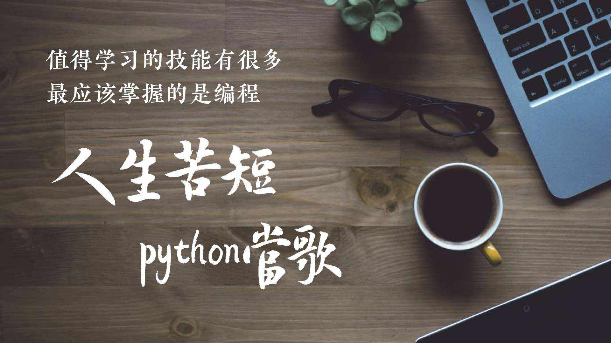

# Python workshop

&emsp;&emsp;随着项目当中越来越多的优秀实践的诞生，随之项目组的所使用的技术栈也越来越广，为了使用同事们的技术储备与项目组同步，特以Workshop的形式共同学习，希望通过该次Workshop，能提升项目组的技术储备的同时，也能有更多的优秀实践，敏捷工具的诞生。

&emsp;&emsp;本次workshop主要针对项目组学习交流Python，暂不对外公开。

## Workshop内容
  * Python基础
  * Python应用之小鸡
  * Python爬取业务数据
  * Python之微服务开发

## 主要安排

  * Ch1
    * Python基础
    * Python应用之小鸡
  * Ch2
    * Python爬取业务数据
  * Ch3
    * Python之微服务开发

## Ch1

1. 先安装Python
2. 基础知识演示

